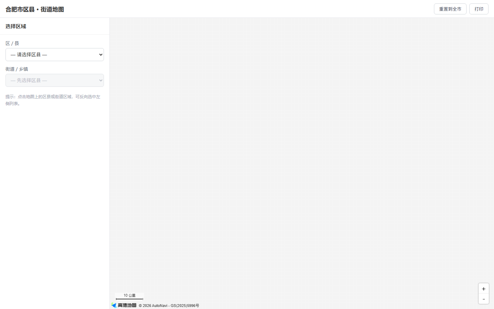
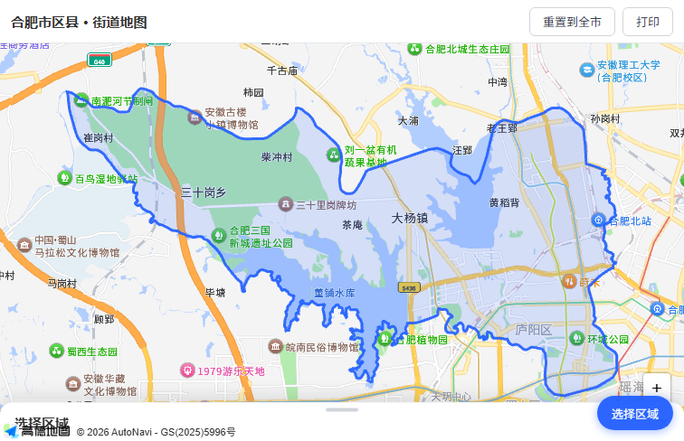
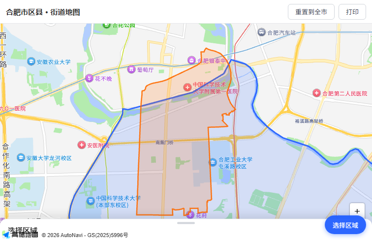
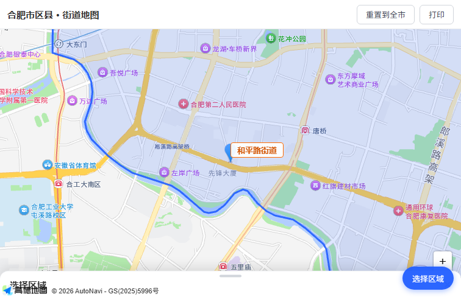
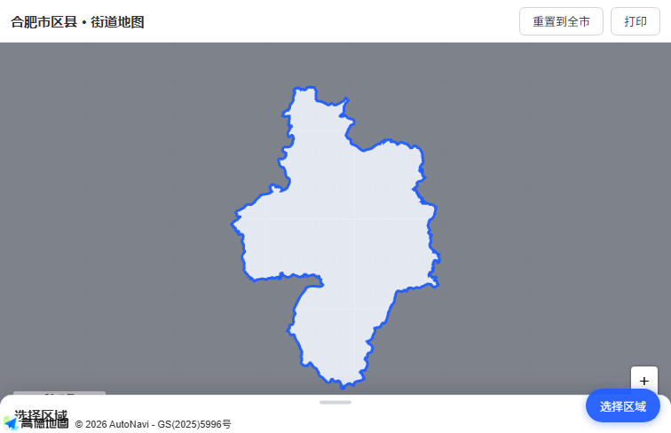
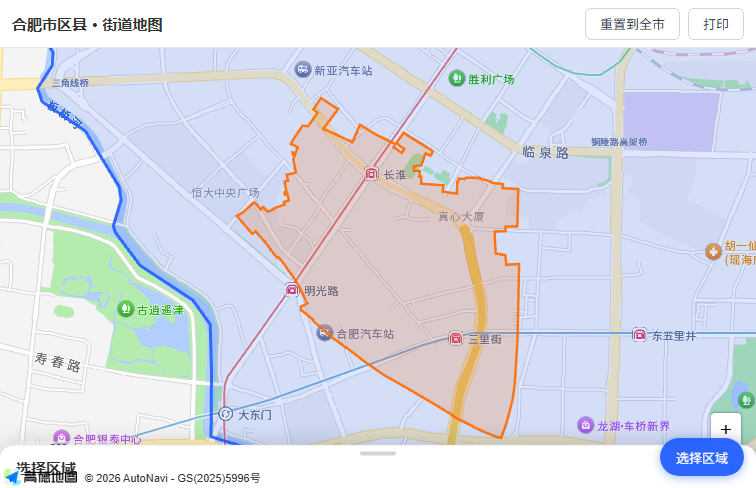

# 合肥市区县 · 街道下钻地图

选择区县，查看其乡镇/街道边界。纯静态，零后端，浏览器打开即用。

在线地址：https://zhushidong.github.io/FMCG-analysis-system/

## 功能特性

- **两级下钻**：先选区县，再选街道/乡镇，地图自动飞行并高亮对应边界
- **区域遮罩**：打开页面默认只显示合肥市区划范围，市外压暗，避免被无关路网干扰
- **名称标签**：当前选中区域名（合肥市 / 瑶海区 / 三里庵街道等）直接浮在地图上
- **秒开缓存**：区县边界、乡镇列表、乡镇边界三层缓存，切换不重复请求
- **纯静态无后端**：整个项目就是一个 `index.html` + 几个 JS/CSS + JSON 数据文件，可部署到任何静态托管

---

## 效果展示

| 步骤 | 说明 |
|------|------|
|  | 默认合肥市遮罩视图，市外压暗 |
|  | 选择庐阳区，蓝色高亮，飞行定位 |
|  | 选择街道后橙色多边形高亮显示边界 |
|  | 部分街道无边界数据时，中心点标记兜底 |
|  | 合肥市遮罩特写，边界描边清晰 |
|  | GitHub Pages 在线访问效果 |

---

## 技术栈与架构

| 层次 | 技术选型 | 说明 |
|------|----------|------|
| 地图渲染 | 高德 JS API 2.0 | 安全密钥鉴权，浏览器端直连 |
| 数据层 | 本地 GeoJSON 文件 | 区县 + 乡镇边界全部预下载，存入 `data/` 目录 |
| 交互层 | 原生 JavaScript（无框架） | 单文件 IIFE 模块，`app.js` 637 行 |
| 部署 | GitHub Pages | 纯静态托管，无需服务器 |

**它是怎么工作的：**

浏览器加载 `index.html` → 先读 `js/config.js`（获取 Key 和区县配置）→ 动态注入高德地图脚本 → 页面初始化完成后，拉取 `data/index.json`（乡镇索引）预加载到内存 → 用户选区县时，优先从本地 `data/districts/{adcode}.json` 读取边界，失败则网络兜底 → 用户选街道时，从本地 `data/{adcode}/{code}.json` 读取边界，无边界则用中心点标记兜底。整个过程不依赖后端，唯一的外部请求是高德渲染 API。

**架构决策亮点：数据全部本地化。** 运行时只依赖高德完成地图渲染，不依赖任何第三方数据接口。即使高德 API 短暂不可用，已缓存的数据仍可在本地文件模式下展示。

---

## 完整工作流：从零到上线

### 阶段 1：需求定义

**做了什么**：明确目标：一个展示合肥市 9 个区县、支持点击查看下属乡镇边界的交互式地图，部署在静态托管，打开即看，不依赖后端。

**为什么这么做**：作为个人学习项目，需要跑通"数据获取 → 处理 → 渲染 → 部署"的完整链路，同时产出可直接复用的行政区划地图开发范式。

### 阶段 2：技术选型

**对比方案：**

| 方案 | 优点 | 缺点 |
|------|------|------|
| 高德在线 DistrictSearch API 实时查询 | 零数据维护 | 每次切换都发起网络请求，慢且不稳定，有调用限流 |
| DataV GeoJSON 实时接口 | 免费，数据更新 | 区县无乡镇级数据，乡镇需另找来源 |
| **本地 GeoJSON 文件（选定）** | 秒开，零运行时依赖，可离线查看 | 数据需预下载，区县边界变更时需重新抓取 |

**选择本地文件的理由**：在线查询慢、不稳定、有被限流风险；本地文件加载是同源请求，毫秒级完成，彻底摆脱运行时依赖。

### 阶段 3：数据获取

**区县边界**：来自阿里云 DataV GeoJSON 免费接口，URL 格式：

```
https://geo.datav.aliyun.com/areas_v3/bound/{adcode}.json
```

其中 `adcode` 是行政区划代码（国家统计局给每个区县分配的唯一 6 位数字编号，地图数据按它来区分归属）。

**乡镇边界**：来自 map.ruiduobao.com 免费行政区划接口。用 `tools/fetch_towns.ps1` PowerShell 脚本批量抓取，每条乡镇调用两个接口：`/api/tree/towns`（获取列表）和 `/getGsonDB`（获取 GeoJSON 文件地址），下载后写入 `data/{区县adcode}/{乡镇代码}.json`。

数据最终落盘到 `data/` 目录，实现本地化。

### 阶段 4：数据处理（踩坑集中区）

**(a) PowerShell 抓取中文乱码**

抓取出的 GeoJSON 文件中文名称全是乱码。原因是 PowerShell 默认使用系统 ANSI 编码写文件，而 GeoJSON 要求 UTF-8。解决方法：改用 Node.js 脚本重新下载，明确指定 UTF-8 编码落盘，彻底修复乱码问题（对应提交 `64d6e31`）。

**(b) 乡镇边界与区县边界不贴合，最远超出 2.7km**

乡镇边界（民政部来源）和区县边界（DataV 来源）是两套独立数据源，坐标系精度和更新周期不同，导致乡镇边界有一部分"溢出"区县范围，最远超出约 2.7km。解决方法：用 `polygon-clipping` 库（基于 Boolean 布尔运算，这里是求交 AND 运算）对全部 126 个乡镇边界与对应区县边界做裁剪，裁剪后 100% 顶点落在区县内或边界线上（对应提交 `c8e8b2f`）。同时删除乡镇 GeoJSON 中失效的 `geom` 大字段，总体积减少 8.4MB。

**(c) 建立乡镇索引供秒开**

创建 `data/index.json`，以区县 adcode 为键，值为该区县下所有乡镇的列表（含 `code`、`name`、`center` 中心点坐标）。页面加载时预取到内存，选区县时无需等待网络即可渲染街道下拉列表。

### 阶段 5：前端开发

**加载顺序**（严格保证，写在 `index.html` 中）：
1. `js/config.js`：配置 Key、安全密钥、区县列表，必须最先加载，否则高德安全密钥鉴权会失败
2. 动态注入高德地图脚本（`_AMapSecurityConfig` 就绪后才插入）
3. `js/app.js`：主逻辑，最后加载

**三层缓存设计**（避免重复网络请求）：
- `districtBoundaryCache`：区县边界 GeoJSON，adcode 为 key
- `streetListCache`：街道列表，adcode 为 key，同一区县只查一次
- `streetBoundaryCache`：街道边界 GeoJSON，`adcode_code` 为 key，选过的街道只 fetch 一次

**健壮性：逐级回退**

区县边界加载失败时，依次尝试：本地文件 `→` DataV 接口 `→` 高德 DistrictSearch API。三条路都失败时控制台输出 `warn`，不阻塞交互。

**竞态防护**：快速切换区县时，旧请求的回调晚到新请求之后到达，会覆盖正确数据。解决方案是用递增序号 `streetReqGen` 做校验，回调返回时检查序号是否匹配，不匹配则丢弃（对应提交 `e005da0`）。

**合肥市遮罩**：用一个覆盖全球的矩形多边形，合肥市边界作为"洞"（内环），洞不填充，所以合肥区域透出，其他区域压暗。选择区县后自动移除遮罩，重置后恢复（对应提交 `57cb0ae`）。

**区域名称标签**：在几何中心位置渲染大字标签，显示当前区域名，自动替换旧标签（对应提交 `c7b8e14`）。

### 阶段 6：测试验证

**数据完整性检查**：JSON 文件可解析、无乱码、`index.json` 索引与 `data/` 目录下实际文件对账。

**交互回归**：用 CDP（Chrome DevTools Protocol，浏览器远程调试协议，可脚本化控制浏览器）驱动 Edge headless 模式，自动化验证两级下钻交互正常，点击区县/街道后地图飞行、高亮、标签显示均符合预期。

### 阶段 7：部署上线

- 初始尝试 Gitee Pages，后因 Gitee 停止免费 Pages 服务，切换至 GitHub Pages
- 高德安全密钥配置域名白名单，只允许 `zhushidong.github.io` 调用 Key
- git 配置双远端备份：`github` + `origin`（Gitee），避免单点故障

### 阶段 8：迭代复盘（6 次提交）

| 提交 | 改了什么 | 解决什么问题 |
|------|----------|--------------|
| `d6967b7` | 初始搭建：两级下钻骨架，区县高亮 + 飞行 | 从无到有，验证技术路线可行 |
| `57cb0ae` | 新增合肥市遮罩视图 | 打开页面不直接暴露全国路网，聚焦合肥市 |
| `c7b8e14` | 区域名称标签 + 街道列表本地化秒开 | 摆脱高德查询等待，切换区县即时响应 |
| `64d6e31` | 修复区县/市边界数据文件 name 字段乱码 | PowerShell 编码问题导致中文全错 |
| `e005da0` | 修复快速切换区县的竞态条件 | 旧请求晚到覆盖新数据，加序号丢弃过期回调 |
| `c8e8b2f` | 乡镇边界裁剪贴合区县边界，删除失效 geom 字段 | 两套数据源不贴合，最远超界 2.7km；体积减少 8.4MB |

---

## 目录结构

```
hefei-map/
├── index.html              # 入口页面，定义加载顺序和 DOM 结构
├── js/
│   ├── config.js           # 高德 Key、安全密钥、区县列表、DataV 地址模板
│   └── app.js              # 主逻辑：地图初始化、缓存、回退、遮罩、标签（637 行）
├── css/
│   └── style.css           # 响应式布局样式，适配手机端抽屉交互
├── data/
│   ├── index.json          # 乡镇索引（区县 adcode → 乡镇列表+中心点），页面加载时预取
│   ├── districts/          # 区县边界 GeoJSON（10 个：合肥市区 + 9 区县）
│   │   ├── 340100.json
│   │   ├── 340102.json     # 瑶海区
│   │   ├── 340103.json     # 庐阳区
│   │   ├── 340104.json     # 蜀山区
│   │   ├── 340111.json     # 包河区
│   │   ├── 340121.json     # 长丰县
│   │   ├── 340122.json     # 肥东县
│   │   ├── 340123.json     # 肥西县
│   │   ├── 340124.json     # 庐江县
│   │   └── 340181.json     # 巢湖市
│   ├── 340102/             # 瑶海区 13 个街道边界 GeoJSON
│   ├── 340103/             # 庐阳区 11 个街道边界 GeoJSON
│   ├── 340104/             # 蜀山区 12 个街道边界 GeoJSON
│   ├── 340111/             # 包河区 10 个街道边界 GeoJSON
│   ├── 340121/             # 长丰县 13 个乡镇边界 GeoJSON
│   ├── 340122/             # 肥东县 20 个乡镇边界 GeoJSON
│   ├── 340123/             # 肥西县 12 个乡镇边界 GeoJSON
│   ├── 340124/             # 庐江县 18 个乡镇边界 GeoJSON
│   └── 340181/             # 巢湖市 17 个乡镇边界 GeoJSON
│                              （共 9 个区县目录 + districts/ + index.json = 137 个数据文件）
├── tools/
│   └── fetch_towns.ps1     # 一次性抓取脚本，开发期用，运行时不依赖
├── docs/
│   ├── stage1-desktop.png  # 初始遮罩视图截图
│   ├── stage2-luyang-highlight.png
│   ├── stage3-street-boundary.png
│   ├── stage3-street-marker.png
│   ├── stage4-citymask.png
│   └── stage4-online.png
└── start.bat               # 一键本地启动：Python HTTP 服务器 + 自动打开浏览器
```

---

## 本地运行指南

1. 用浏览器打开项目根目录，或双击 `start.bat`
2. `start.bat` 会自动启动 Python 本地 HTTP 服务器（端口 8080），并打开浏览器访问 `http://localhost:8080`
3. 如果直接双击 `index.html`（`file://` 协议），高德安全密钥会拒绝请求，所以推荐用 `start.bat`

**更换高德 Key**：编辑 `js/config.js`，把 `key` 和 `securityJsCode` 替换成你自己的（在高德开放平台控制台申请，申请后把部署域名加入白名单）。

---

## 踩坑清单

| 问题 | 原因 | 解决方案 |
|------|------|----------|
| 乡镇边界 GeoJSON 中文乱码 | PowerShell 默认 ANSI 编码写文件，不是 UTF-8 | 改用 Node.js 脚本重新下载，指定 UTF-8 编码 |
| 乡镇边界超出区县边界最远 2.7km | 两套数据源（民政部 vs DataV）坐标系精度不同 | 用 `polygon-clipping` 库对乡镇边界做求交裁剪，限制在区县范围内 |
| 快速切换区县时街道列表数据串了 | 异步请求竞态：旧请求晚到，回调覆盖了新数据 | 递增序号 `streetReqGen` 做校验，过期回调直接丢弃 |
| 快速切换区县时边界画错 | 旧区县边界请求晚到新区县之后 | 取消"回退绘制"逻辑，边界加载失败只输出 console.warn |
| 直连 `file://` 无法加载地图 | 高德安全密钥校验来源域名，`file://` 不在白名单 | 用 `start.bat` 启动本地 HTTP 服务器（`http://localhost:8080`） |
| Gitee Pages 部署失效 | Gitee 停止免费 Pages 服务 | 迁至 GitHub Pages |

---

## 术语表

| 术语 | 通俗解释 |
|------|----------|
| GeoJSON | 一种用 JSON 格式描述地理边界的开放标准，本质是一组经纬度坐标列表 |
| adcode | 行政区划代码，国家统计局给每个区县分配的唯一 6 位数字编号，如合肥市 340100、瑶海区 340102 |
| API | 应用程序编程接口，这里指高德地图提供的数据查询服务，按 URL 调用返回 JSON 数据 |
| Polygon / 多边形 | 由多条首尾相连的线段围成的封闭图形，地图上用多边形表示一个区县的边界轮廓 |
| 缓存 | 把已经请求过的数据暂存在内存里，下次需要时直接读取，不再重复发网络请求，提速明显 |
| 竞态条件 | 多个异步操作交叉执行时，结果顺序不确定导致数据错乱，这里表现为旧请求晚到覆盖新数据 |
| CDP | Chrome DevTools Protocol，浏览器远程调试协议，可以脚本化控制浏览器完成自动化测试 |
| 安全密钥 | 高德 JS API 2.0 额外要求的一串密钥，和 Key 配对使用，防止 Key 被滥用 |
| 白名单 | 在高德控制台配置的允许调用 Key 的域名列表，不在列表里的域名调用会被拒绝 |
| 布尔运算（求交） | 两个多边形取交集的几何运算，这里用来把超出区县范围的乡镇边界"剪掉"，让边界严丝合缝 |

---

## 复用到其他城市

换两块东西就可以照搬到任意城市：

1. `js/config.js` 里的 `districts` 列表（区县名称 + adcode）和 `cityAdcode`
2. 重新运行 `tools/fetch_towns.ps1`，改脚本顶部的 `$province`、`$city` 变量为目标城市名，即可批量抓取该镇级边界数据

数据部分完成后，前端代码基本不需要改动。
